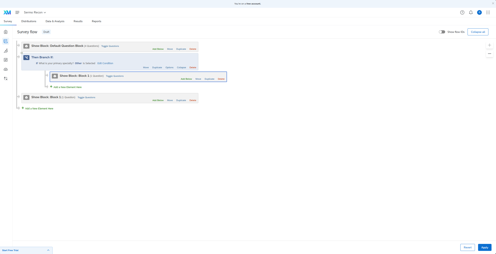
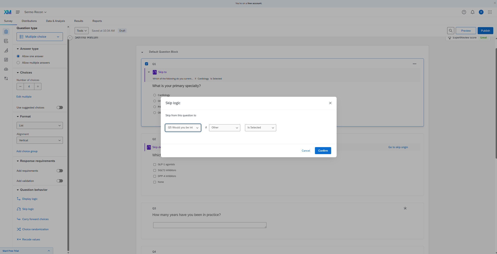

# Sermo Survey Builder — Writeup

**Live demo:** [My Vercel Application](https://sermo-survey-builder.vercel.app/)
**Repo:** [My Github Repo](https://github.com/DarrenKo97/Sermo-Survey-Builder)

## Five UX decisions made differently from Qualtrics

**1. Branching is one inline primitive, not three logic systems across two screens.**

Qualtrics splits branching across three different systems. Skip Logic lives in the question sidebar but only goes forward and only within a block. Display Logic conditionally hides a question but quietly inserts a page break when you use it. Branch Logic lives in a completely separate Survey Flow screen. While building a test survey I tried to skip from Q1 in one block to Q5 in another, hit a toast that read "Questions with skip logic can't be moved to different blocks," and ended up composing two systems across two screens to do one thing.

My tool has one primitive, configured inline below the question that triggers it:

```
{ if: { questionId, op, value }, then: { goto } }
```

One concept. One place. The forward-only, block-scoped, page-break-injecting rules don't exist because the blocks don't exist.




**2. Numeric is a first-class question type, not a validation rule on Text Entry.**

Asking "how many years have you been in practice?" in Qualtrics means picking Text Entry, then drilling into the sidebar to find Content Type, then choosing Number, then setting Min and Max. Numeric isn't in the question-type picker at all. For a tool aimed at clinical research where numeric answers are common (years in practice, patients per week, dosages), that's setup friction every time. My tool lists Number alongside the other four types, with min, max, and decimals as primary fields in the editor.


**3. No blocks.**

Qualtrics organizes surveys into Blocks, which is where most of the routing complexity comes from. Blocks scope skip logic. Blocks force you into Survey Flow to compose anything across them. Blocks also create a hidden Trash block that parks your deleted questions instead of removing them (I found mine still in the exported QSF). For a linear survey with one branching primitive, blocks add complexity for no obvious user benefit. My tool stores questions as a flat ordered array. Delete deletes. Reorder moves position. The data model fits on one line.


**4. The empty state asks a question instead of pre-inserting one.**

Open a new survey in Qualtrics and there's already a three-option multiple choice question sitting there with placeholder text. You spend the first second of every new survey figuring out whether that's yours or a template, then either edit it or delete it. My empty state asks "What do you want to ask first?" in serif display and waits. The first real action is intentional, not a cleanup.


**5. JSON is the primary export. The definition is data, not a backup format.**

Export in Qualtrics is two levels deep under a generic Tools menu (Tools → Import/Export → Export Survey), and what you get back is a `.qsf` file. Their own docs warn you not to open it because editing breaks things. My tool puts Export at the top of the page next to Preview and Save, and what comes out is plain JSON with the same shape as the runtime data. Anyone can open it, read it, modify it, or feed it into a script.


## Three features I deliberately left out

**Question and choice randomization.** Sermo's panel team picks the audience upstream. Physicians on a verified network aren't a general-public sample where order effects need controlling. If a methodology team needs it later, it's a v1.1 problem.

**Quotas and response caps.** N-counts and audience targeting are handled on the recruitment side of Sermo's platform, not at survey-fill time. Putting quota management into the survey tool duplicates a system that already exists. The tool's job is to collect responses, not decide who gets to respond.

**Multi-language and translation workflows.** Pharma studies tend to be scoped per-language per-study. English-only v1 is fine. The cost of doing i18n right in the builder (translation panes, language switching, per-language preview, RTL) is significant and the v1 payoff is zero. v2 problem if a global study asks for it.

## How the codebase is structured for AI extensibility

Every question type lives in `src/question-types/<name>/` and exports five things: `defaultValue` (returns a fresh instance), `predicates` (which branching operators it supports), `Editor` (the builder-side React component), `Respondent` (the taker-side component), and `validate` (returns an error message or null). A single `src/question-types/index.ts` registers them in a `registry` object. The edit page and take page both dispatch by `question.type` through the registry and never reference any specific type.

To add a fifth question type, you copy a folder, implement the five exports, add one line to the registry, and one line in the labels map. No edits to the builder, the respondent shell, the branching UI, the database schema, or the JSON export.

I tested this before submitting by actually adding a Ranking type with up/down item reordering. From `cp -r singleSelect ranking` to working in the live UI took under twenty minutes. The Ranking module is still in the repo as a worked example sitting next to `singleSelect`; you can diff the two folders and see the contract laid out.

Why this works for an agent: the contract is small, five exports per type, and the shape doesn't change between types. An agent extending this codebase reads one folder as a reference, copies it, edits the five exports, and the rest of the app picks up the new type through the registry without changes. Next.js helps too. `create-next-app` now ships `AGENTS.md` and `CLAUDE.md` files specifically to guide coding agents toward current framework patterns, which sit cleanly alongside the type-folder contract.

## Tool use

Built with Claude in the chat interface for architecture, code, and writeup help. Roughly three hours of focused build time after a Qualtrics recon and an architecture pass on paper. The plan, contract design, scaffolding, and most component code came from Claude. Every file in `src/` got reviewed by hand before commit, and the bugs that came up (a React Compiler hoisting issue, the Supabase publishable-key rename, numeric validation gating, a back-button branching edge case) got diagnosed and patched live in the conversation. Stack: Next.js 16, Tailwind v4, Supabase with open-RLS for the demo, Vercel for hosting.
